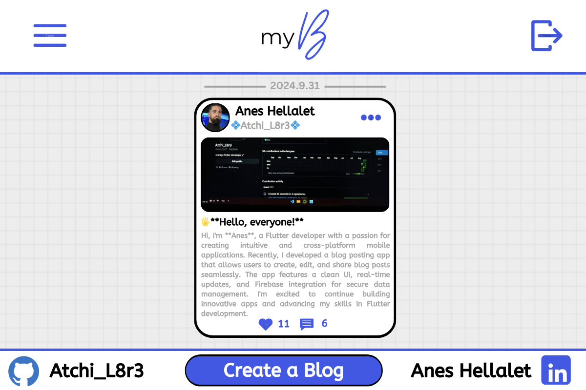
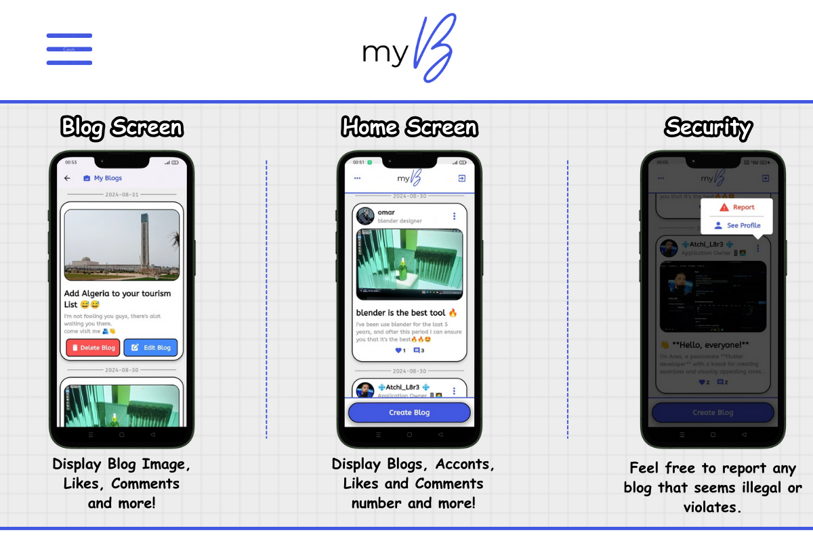
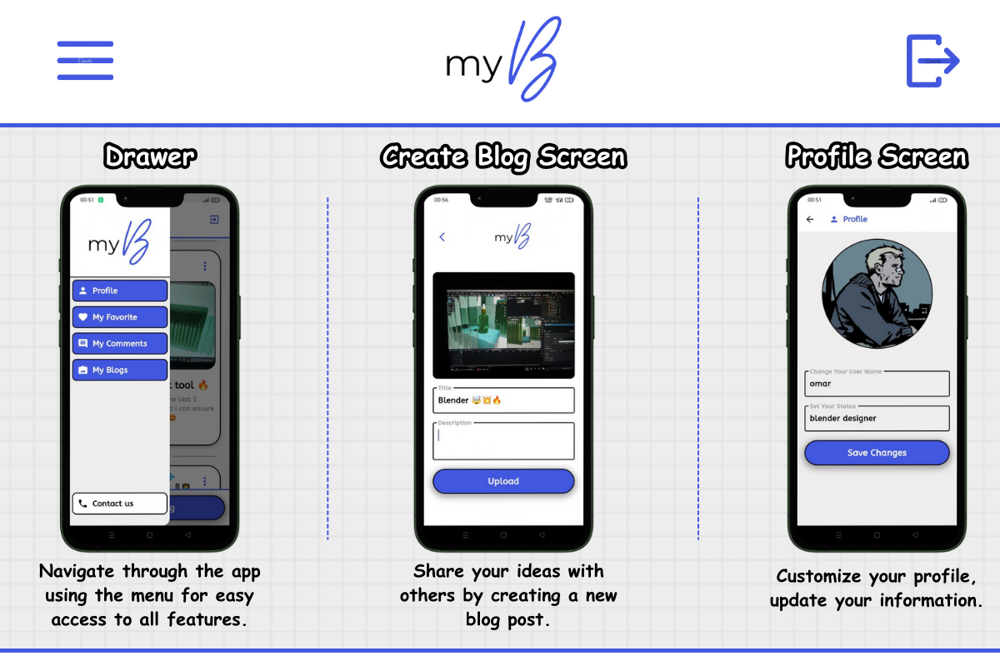
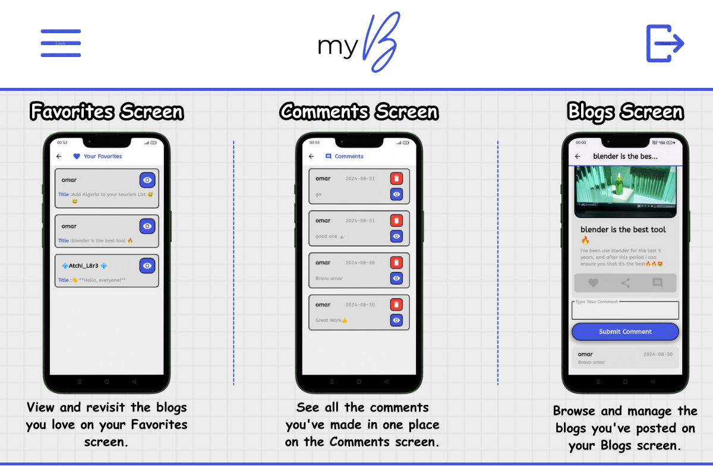
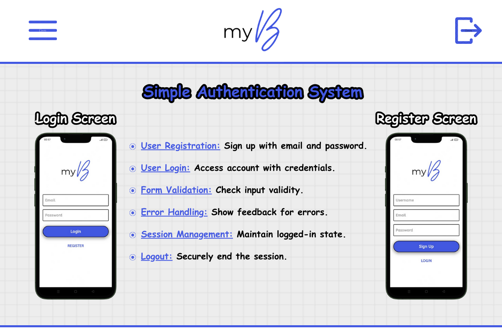
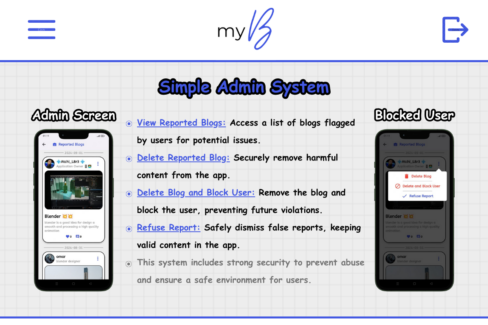

# 🎉 Welcome to myB a Blog Application! 📝

My Blog App is your go-to platform for sharing ideas, stories, and experiences with the world! 🌍 Whether you're a seasoned writer or just starting, this app makes it easy to create and manage your blog posts in a vibrant community. Connect with others, express yourself, and explore content that inspires you. 🚀

Create, share, and connect like never before with My Blog App! 💡

## 📸 Screenshots

## 🌟 Features

Share your thoughts and ideas by crafting new blog posts.

Keep the community safe by reporting any blogs that seem illegal or violate guidelines.

Get involved by commenting on and liking the blogs you enjoy the most.

Personalize your profile and keep your information fresh.

Discover and explore the profiles of other users.

Easily manage your posts by editing or deleting them whenever needed.

Keep your blog clean by removing unwanted comments.

Securely register and log in with strong error handling and session management.

Swiftly navigate the app using the handy Flutter drawer.

Admins can view reported blogs, remove harmful content, and block users to ensure a safe community.

## 💻 Technologies Used

Our app is built using some of the latest and greatest technologies! Here’s what powers **My Blog App**:

The powerful UI toolkit that allows us to build natively compiled applications for mobile, web, and desktop from a single codebase.

- **Firestore**: Our real-time NoSQL cloud database for storing and syncing data across all users instantly.
- **Storage**: Securely store and serve user-generated content like images and files.

A super-fast and lightweight database solution for offline data storage, ensuring your data is always available, even when you're not connected to the internet.

These technologies work together to provide a seamless and robust experience for our users. 🚀

## 📞 Contact Us

If you have any questions or feedback, feel free to reach out:

- **Facebook**: [Facebook](https://facebook.com/yourprofile)
- **LinkedIn**: [LinkedIn](linkedin.com/in/anes-hellalet/)

We hope you enjoy using My Blog App as much as we enjoyed building it! 🚀
